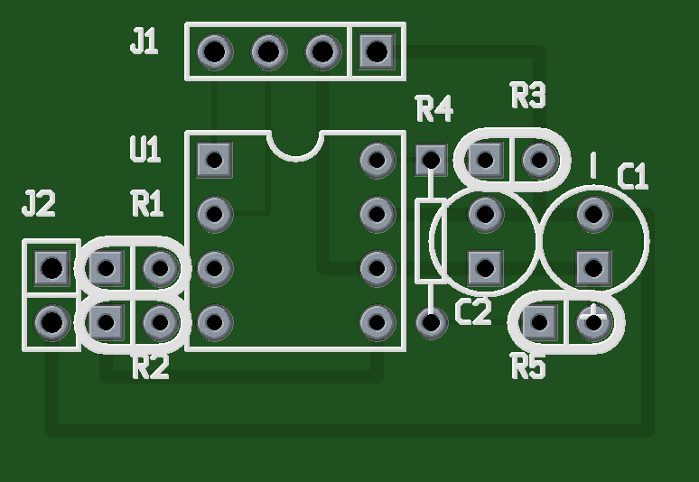
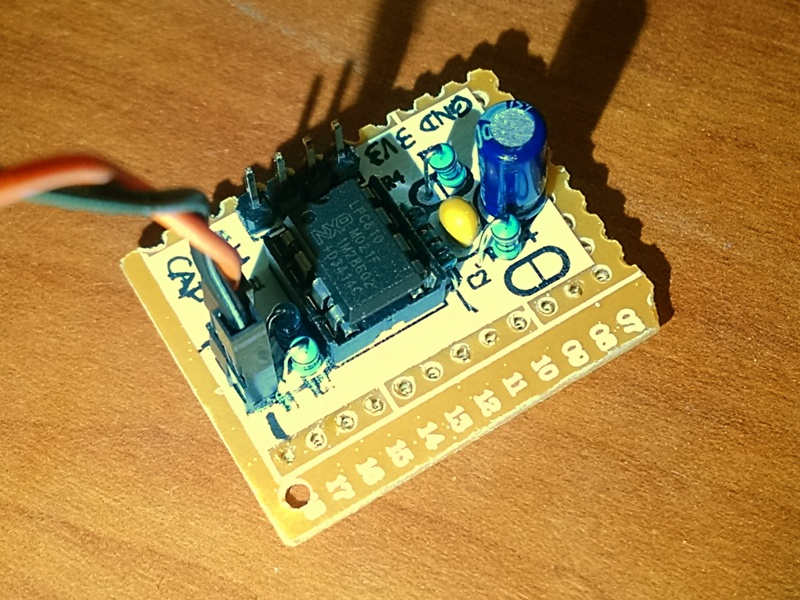

LPC810-based Capacitance Meter
==============================

Pros:

* Dual-speed measurement
* Auto-ranging
* 1pF to 9999.99uF
* Reasonable precision after stray capacitance subtracted
* Calibration-free for C > 1nF if precision resistors used
* UART output (115200 8N1)
* Compact
* Affordable
* Single-chip, low component count
* SMD-free, prototype-board-friendly layout
* Only uses common components
* Microcontroller can be flashed via UART

Cons:

* May get affected by ESR and leakage
* Measuring frequency not controllable
* 1% error in clock introduced by the microcontroller
* Require relatively new arm-none-eabi toolchain for reasonable binary size
* Time-constant-based approach is not as precise as LCR bridge
* Requires 3.3V power supply

Refs:

* [Capacitance Meter and RC Time Constants](http://www.arduino.cc/en/Tutorial/CapacitanceMeter)
* [Getting Started with the LPC810](https://learn.adafruit.com/getting-started-with-the-lpc810/introduction)
* [LPC810 CodeBase](https://github.com/microbuilder/LPC810_CodeBase)
* [lpc21isp](http://sourceforge.net/projects/lpc21isp/)
* [GNU Tools for ARM Embedded Processors](https://launchpad.net/gcc-arm-embedded) **(Please use this toolchain or code size can get BIG)**
* [LPCXpresso Sample Code Bundle for the LPC8xx](http://www.lpcware.com/content/nxpfile/lpcxpresso-sample-code-bundle-lpc8xx)
* [NXP Switch Matrix Tool for LPC81x](http://www.lpcware.com/content/nxpfile/nxp-switch-matrix-tool-lpc800)
* [A smarter way to write micros()](http://micromouseusa.com/?p=296)

Images:

Pin Assignment:

         +---v---+
    TXD -|1     8|- VREF
    RXD -|2     7|- GND
    IO3 -|3     6|- 3V3
    IO2 -|4     5|- VCAP
         +-------+
